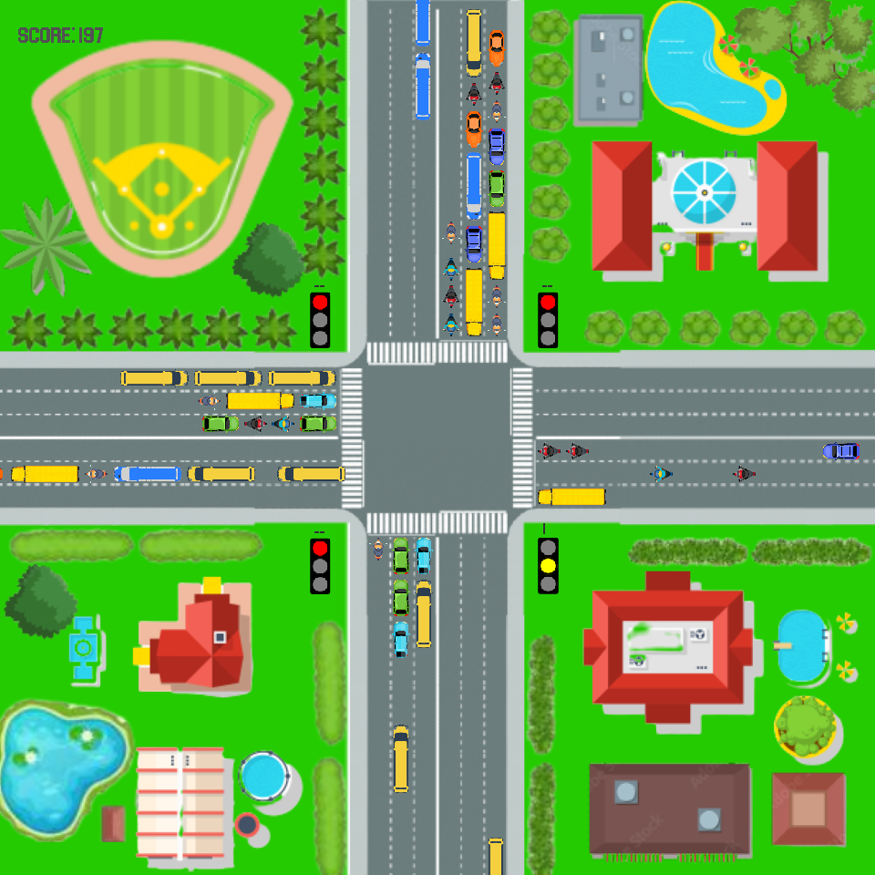

# Traffic Lights Game

Traffic Lights Game is a simple, endless traffic control simulator built in C++ using SDL2, SDL2_image, and SDL2_ttf. The goal is to keep a 4-way intersection flowing smoothly and rack up as many points as possible!

## Overview

- **Gameplay:**  
  You control the traffic lights at a single 4-way intersection. Cars spawn randomly and at an increasing rate over time. The game continues endlessly until a car hits the window border, signaling a traffic jam and ending the game.

- **Scoring:**  
  Earn points by letting vehicles pass:
  - **Bike:** 1 point
  - **Car:** 2 points
  - **Bus:** 4 points

## Visuals & Style

- **Art Style:**  
  Retro pixel art that adds a nostalgic vibe.
- **Platform:**  
  Windows only.

## Controls

- **Keyboard:**  
  Use **W, A, S, D** to toggle the traffic lights and manage the intersection.

## Technical Details

- **Language:**  
  C++
- **Libraries:**  
  - SDL2  
  - SDL2_image  
  - SDL2_ttf
